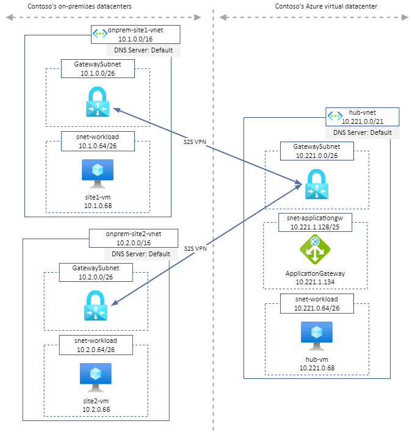

# LAB - Load Balance on-premise applications from Azure

Documentation is available [here](https://davidsantiago.fr/expose-onpremise-applications-with-application-gateway/).

**Architecture**:

 

**Quick start**:

* Clone the GitHub repository
  
`git clone https://github.com/dawlysd/lab-ag-onpremiseapplications`

* Go to the new folder "lab-ag-onpremiseapplications/templates" and initialize the terraform modules 
  
`cd lab-ag-onpremiseapplications/templates`

`terraform init`

* Now run apply to start the deployment
  
`terraform apply`